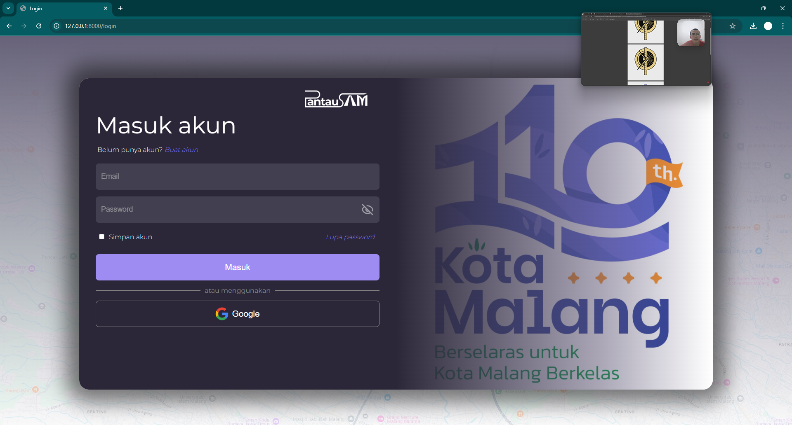
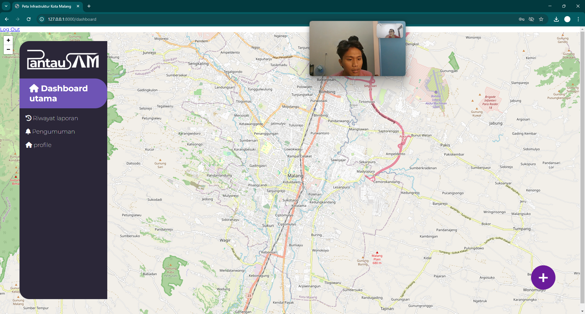

# PantauSAM

PantauSAM adalah platform berbasis web yang memungkinkan masyarakat untuk melaporkan kondisi infrastruktur di sekitar mereka. Laporan yang dikirimkan oleh pengguna akan diverifikasi oleh admin sebelum ditampilkan pada peta interaktif. Tujuan dari platform ini adalah meningkatkan transparansi dan partisipasi masyarakat dalam pengawasan pembangunan infrastruktur.

## Fitur Utama
- **Pelaporan Infrastruktur**: Pengguna dapat membuat laporan dengan mengunggah deskripsi, lokasi, dan media pendukung (foto/video).
- **Verifikasi Admin**: Setiap laporan akan diverifikasi oleh admin sebelum dipublikasikan.
- **Peta Interaktif**: Laporan yang telah diverifikasi akan ditampilkan pada peta yang dapat di geser dan zoom-in dan zoom-out untuk mempermudah pemantauan.
- **Status Pengerjaan**: Pengguna dapat melihat status terbaru dari laporan mereka.


## Teknologi yang Digunakan
- **Backend**: Laravel 11
- **Frontend**: Blade Templates & CSS & JS
- **Database**: MySQL
- **Server**: XAMPP (pengembangan lokal)
- **Autentikasi**: Laravel Breeze dengan dukungan multi-role (user & admin)

## Instalasi
1. Clone repository ini:
   ```bash
   git clone https://github.com/faidzagustiawan/PantauSAM
   ```
2. Masuk ke direktori proyek:
   ```bash
   cd PantauSAM
   ```
3. Install dependensi dengan Composer:
   ```bash
   composer install
   ```
4. Install dependensi frontend:
   ```bash
   npm install && npm run dev
   ```
5. Konfigurasi file `.env`:
   ```bash
   cp .env.example .env
   ```
   Sesuaikan konfigurasi database dan mail.
6. Generate application key:
   ```bash
   php artisan key:generate
   ```
7. Jalankan migrasi database:
   ```bash
   php artisan migrate --seed
   ```
8. Jalankan server lokal:
   ```bash
   php artisan serve
   ```

## Kontribusi
Kami terbuka untuk kontribusi! Jika ingin berkontribusi, silakan fork repository ini dan buat pull request.

## Lisensi
Proyek ini dilisensikan di bawah [MIT License](LICENSE).

## Kontak
Jika ada pertanyaan atau masukan, silakan hubungi kami di [muhammadfaidzagustiawan@gmail.com](muhammadfaidzagustiawan@gmail.com).


